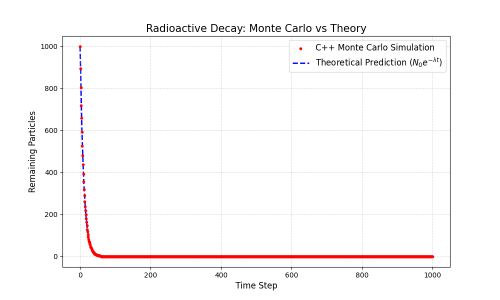

# Radioactive Decay Simulation (C++ & Python) ☢️

## Overview
A comparative study of Monte Carlo simulations for radioactive decay kinetics. This project implements a stochastic simulation in C++ to validate the exponential decay law $N(t) = N_0 e^{-\lambda t}$ against a theoretical model.

## 
* **Simulation:** C++ (Iterative Monte Carlo method)
* **Visualization:** Python (Pandas & Matplotlib)
* **Results:** Validated statistical variance against analytical predictions.

## Visuals

